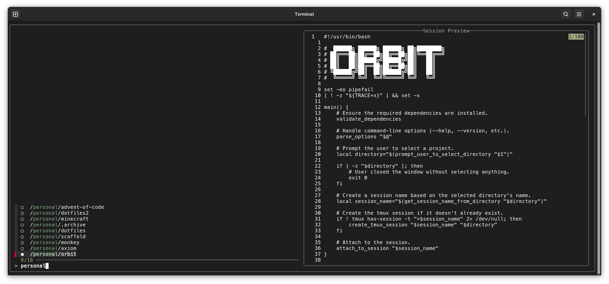

# Orbit

**Orbit** is a personalized version of [tmux-sessionizer], allowing you to
quickly spin up pre-configured tmux sessions for your projects. It supports
running custom scripts and falls back to a global default when needed.

<div align="center">
    
</div>

## Getting started

To use Orbit, you'll need to install the following dependencies:

- [bash] (version 5.2 or higher),
- [tmux] (version 3.5a or higher),
- [fzf] (version 0.59 or higher) for fuzzy finding project directories, and
- [make] (version 4.4 or higher) to install the project.

### Installation

Once you have the dependencies installed, you can install Orbit using make:

```bash
make install
```

Verify the installation by running:

```bash
orbit --version
```

### Initial setup

Try running `orbit` to see the project selection prompt. Initially, the list
will be empty.

### Configuration

To populate the project list, you need to define the `ORBIT_PATH` environment
variable. This variable should contain a colon-separated list of directories,
similar to the `PATH` variable.

To get something up and running quickly, run the following:

```bash
# From the directory where you normally keep your projects:
export ORBIT_PATH="$PWD"
orbit
```

As a more realistic example, let's say your project directory looks like this:

```
$HOME
└── projects
    ├── personal
    │   └── ...
    └── work
        ├── company_a
        │   ├── ...
        ├── company_b
        │   ├── ...
        └── company_c
            └── ...
```

You can add the following to your `.bashrc` file to set the `ORBIT_PATH`
variable:

```bash
get_orbit_paths() {
    local personal="$HOME/projects/personal"

    # Each client has their own subdirectory with projects inside.
    local work="$(find "$HOME/projects/work" -mindepth 1 -maxdepth 1 -type d -printf "%p:" | sed 's/:$//')"

    echo "$personal:$work"
}
export ORBIT_PATH="$(get_orbit_paths)"
unset -f get_orbit_paths
```

Then, either run `source ~/.bashrc` or restart your terminal and run `orbit` to
display a list of all your projects.

## Attaching to sessions

The `orbit` command accepts an optional argument, which allows you to pass a
query to the interactive finder. If the query matches only one option, Orbit
will automatically connect you to that session.

For a full list of available commands, try `orbit --help`.

### Custom scripts

When Orbit creates a new tmux session, it looks for an `orbit.sh` script at the
following locations:

1. The target project's root directory.
1. In the user's config directory (i.e., `$XDG_CONFIG_HOME/orbit`).
1. If there is no script in the config directory, a default one is created.

## Troubleshooting

If you encounter issues with Orbit, here are some common problems and
solutions:

- **Orbit doesn't recognize my projects**: Make sure that the `ORBIT_PATH`
  variable is set correctly and that the project directories are in the correct
  locations, close and reopen the terminal. You can use the following command
  to expand `ORBIT_PATH`:

  ```bash
  find $(echo "$ORBIT_PATH" | tr ':' ' ') -mindepth 1 -maxdepth 1 -type d
  ```

To report a bug or request a new feature, create a new issue
[here](https://github.com/nicdgonzalez/orbit/issues).

## Additional Resources

- [Repository (GitHub)](https://github.com/nicdgonzalez/orbit)
- [tmux Documentation](https://github.com/tmux/tmux/wiki)
- [Guide to learning tmux](https://hamvocke.com/blog/a-quick-and-easy-guide-to-tmux/)

[bash]: https://www.gnu.org/software/bash/
[fzf]: https://github.com/junegunn/fzf
[make]: https://www.gnu.org/software/make/
[tmux]: https://github.com/tmux/tmux
[tmux-sessionizer]: https://github.com/ThePrimeagen/tmux-sessionizer
